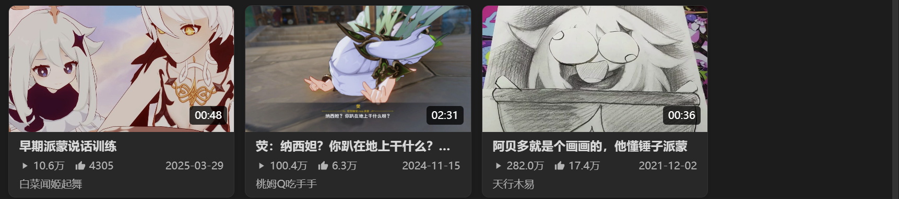
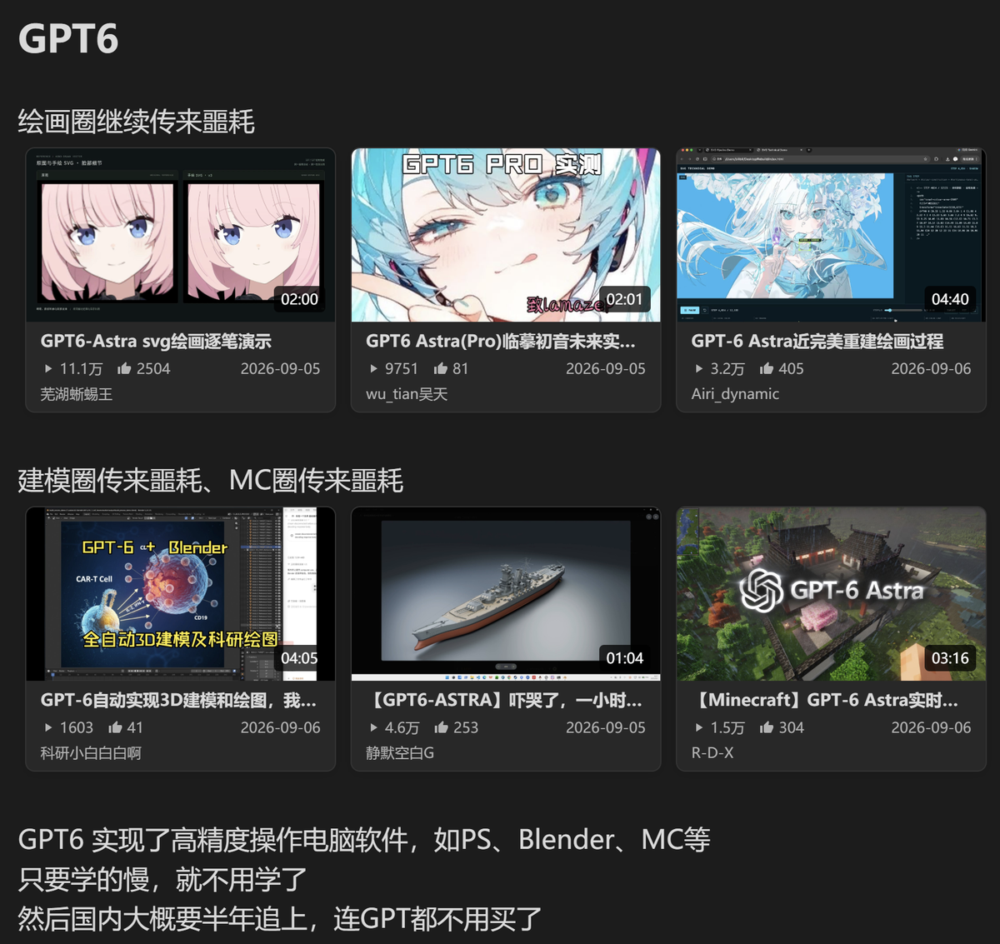
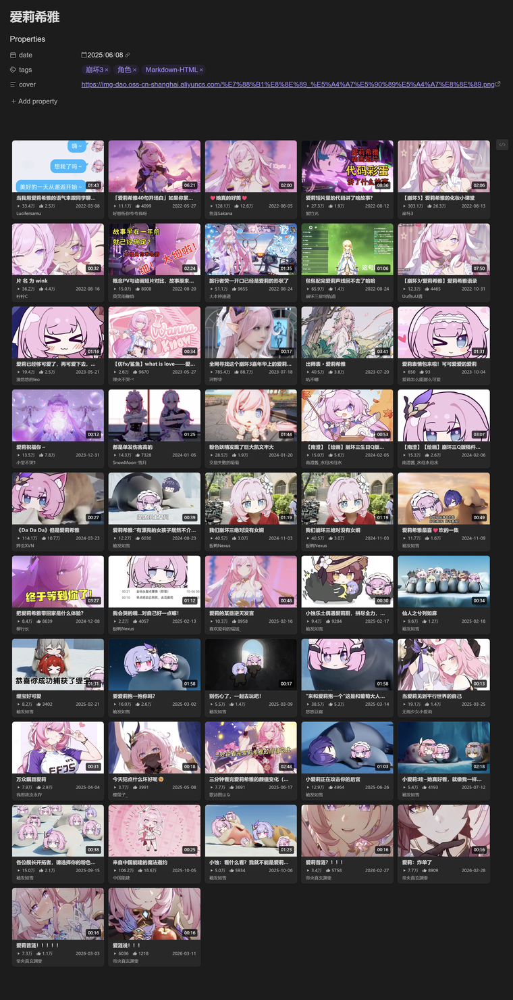
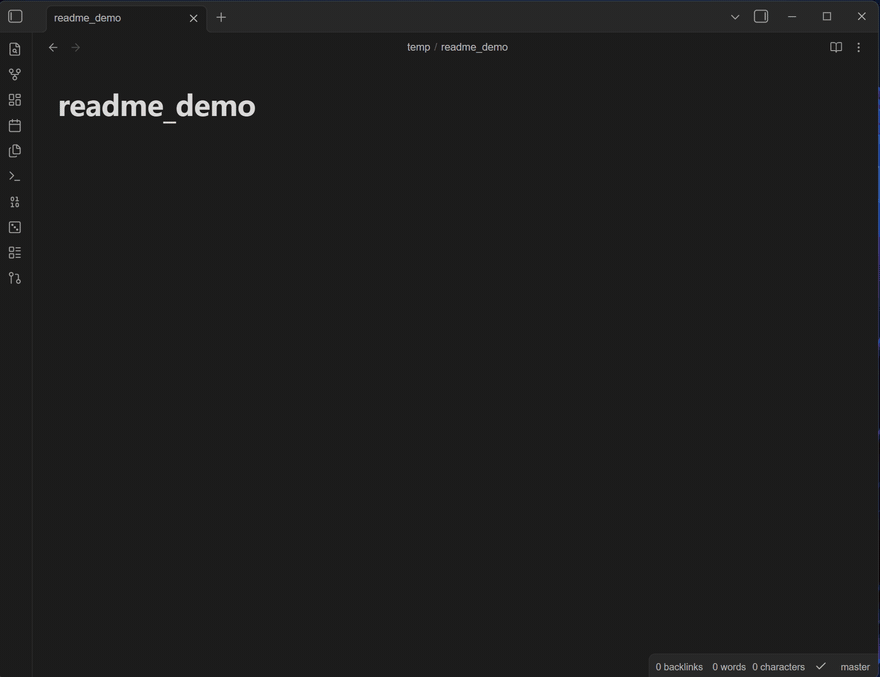

<div align="center">

# Bili Card · B 站卡片

**让 Obsidian 插入 B 站视频卡片。**

贴个链接,笔记里就多一张卡:封面、时长、播放量、点赞、UP 主、日期,自动拉取,自动排版。

一段文字配一张卡,是在做笔记;一排卡连成画廊,是收藏夹搬到了库里。




*Paste a Bilibili link, get a beautiful card — video cards & UP-owner cards, fetched and laid out automatically.*

</div>

---

## 📝 用在哪

<table>
<tr>
<td width="62%" valign="top">

<b>做笔记</b>:卡片嵌在文字旁边,视频出处和笔记上下文在一起
</td>
<td width="38%" valign="top">

<b>收藏视频</b>:几十张卡自动排成一面好逛的画廊墙
</td>
</tr>
</table>

## ✨ 一眼看懂

<div align="center">

</div>

**右键 → `插入 B 站卡片`**(或命令面板),粘贴链接、点生成,卡片就有了。
悬停卡片点右上角 `</>`,整个画廊进入编辑态:HTML 源码 + 语法高亮、增删、排序,完成一键写回。

## 🎯 它能干什么

| | |
| :--- | :--- |
| 🎬 **视频卡** | 封面 + 时长角标 + 标题 + 播放量/点赞 + UP 主 + 发布日期 |
| 👤 **UP 主卡** | 头像 + 昵称 + 粉丝数,可挂代表作视频 |
| 📥 **批量导入** | 链接每行一个,一次生成一批,失败的自动跳过 |
| ✍️ **纯文本存储** | 一行一张卡,数据在 `data-*` 属性里,随时手改、永不锁死 |
| 👁 **双模式渲染** | Live Preview / 阅读模式都渲染;无插件环境退化为普通链接 |
| ☁️ **零本地负担** | 封面走 B 站 CDN 云端 URL,不下载到本地,库体积零增长 |

## 🛠 画廊编辑

连续的卡片行自动合并成画廊。编辑态是内嵌 CodeMirror(HTML 语法高亮跟随主题),顶部工具栏:

| 按钮 | 作用 |
| --- | --- |
| 通过 URL 添加 | 拉取新卡片,追加到当前画廊 |
| 按日期排序 | 往复切换 新→旧 / 旧→新,无日期的排最后 |
| 转回链接 | 卡片还原成 `[标题](链接)`,随时退回纯文本排版 |
| 完成 / 取消 | 统一写回 / 放弃改动 |

## 🎚 高度可调

设置面板分组调节,**改样式不用动笔记**:

- **布局**:卡片宽度 · 封面宽高比(16/9、4/3、竖封面都行)· 卡片间距 · 标题行数 · 文本上下间距
- **UP 主卡**:头像大小
- **字体**:卡片字体 / 字号、源码编辑器字体 / 字号

## 📝 手写格式

一行一张卡,模板和样式完全由插件负责:

```html
<div class="bili-card" data-bvid="BV1xx411c7mD" data-title="视频标题" data-cover="https://i0.hdslb.com/bfs/archive/xxx.jpg" data-duration="03:45" data-views="12.3万" data-likes="1.2万" data-up="UP主名" data-date="2024-01-01"><a href="https://www.bilibili.com/video/BV1xx411c7mD">视频标题</a></div>
```

```html
<div class="bili-up-card" data-mid="4176573" data-name="UP主名" data-face="https://i0.hdslb.com/bfs/face/xxx.jpg" data-fans="68.9万"><a href="https://space.bilibili.com/4176573">UP主名</a></div>
```

UP 主卡可选代表作:追加 `data-bvid` / `data-vtitle` / `data-vcover`。

## 🖼 图片与防盗链

封面/头像直接用 B 站 CDN 云端 URL(`i*.hdslb.com`),渲染时带 `referrerpolicy="no-referrer"` 绕过防盗链,**不下载到本地**,库体积零负担。

## 👨‍💻 开发

```bash
npm install
npm run build   # 打包出 main.js
npm run dev     # watch 模式
```

源码在 `src/`(卡片渲染 `video-card.js` / `up-card.js`,画廊与编辑态 `gallery.js`,源码编辑器 `source-editor.js`,样式 `css.js`,设置 `settings.js` / `settings-tab.js`),esbuild 打包为根目录 `main.js`。`@codemirror/*` 与 `@lezer/*` 复用 Obsidian 运行时(external),只打包 `@lezer/html` 语法表。

<div align="center">

## License

MIT · made with ❤ for Obsidian & Bilibili

</div>
