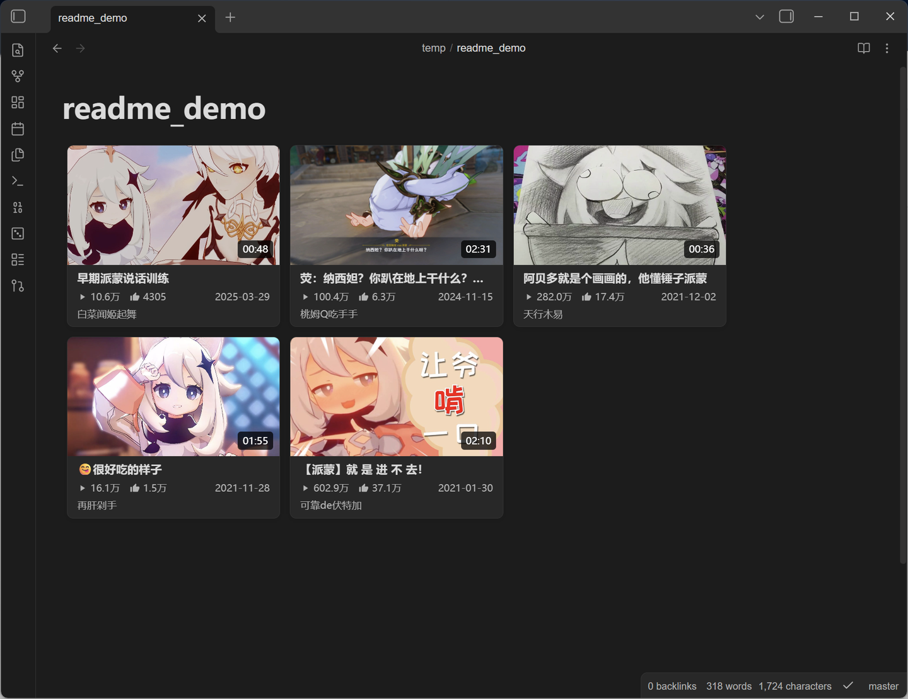

# Bili Card · B 站卡片

<p>
  
</p>

<p>
  
  
  
</p>

**贴个链接，就是一张卡片。** 在 Obsidian 里把 B 站视频 / UP 主收藏成漂亮的卡片画廊——封面、时长、播放量、点赞、UP 主、日期，自动拉取，自动排版。

Paste a Bilibili link, get a beautiful card. Video cards (cover · duration · views · likes · uploader · date) and UP-owner cards (avatar · fans · featured video), fetched and laid out automatically.

## 效果预览

<p>
  
</p>

- **视频卡**:封面 + 时长角标 + 标题 + 播放量/点赞 + UP 主 + 发布日期
- **UP 主卡**:头像 + 昵称 + 粉丝数,可挂代表作视频
- **Live Preview / 阅读模式**都渲染;无插件环境(如 Publish)退化为普通链接,笔记永不锁死

## 30 秒上手

**右键 → `插入 B 站卡片`**,或命令面板执行同一个命令:

<p>
  
</p>

- 支持**视频链接 / BV 号**和 **UP 主空间链接 / mid**
- 链接**每行一个,批量导入**,失败的自动跳过;UP 主卡可另填代表作视频链接
- 插入后是**一行为一张卡**的纯文本格式,随时可手改

## 画廊编辑

连续的卡片行自动合并成画廊。点卡片 = 打开链接;点右上角 `</>` = 编辑源码(内嵌 CodeMirror,HTML 语法高亮跟随主题):

| 按钮 | 作用 |
| --- | --- |
| 通过 URL 添加 | 拉取新卡片,追加到当前画廊 |
| 按日期排序 | 往复切换 新→旧 / 旧→新,无日期的排最后 |
| 转回链接 | 卡片还原成 `[标题](链接)`,随时退回纯文本排版 |
| 完成 / 取消 | 统一写回 / 放弃改动 |

## 高度可调

设置面板分组调节,**改样式不用动笔记**(数据全在 `data-*` 属性里):

- **布局**:卡片宽度 · 封面宽高比(16/9、4/3、竖封面都行)· 卡片间距 · 标题行数 · 文本上下间距
- **UP 主卡**:头像大小
- **字体**:卡片字体 / 字号、源码编辑器字体 / 字号

## 手写格式

一行一张卡,模板和样式完全由插件负责:

```html
<div class="bili-card" data-bvid="BV1xx411c7mD" data-title="视频标题" data-cover="https://i0.hdslb.com/bfs/archive/xxx.jpg" data-duration="03:45" data-views="12.3万" data-likes="1.2万" data-up="UP主名" data-date="2024-01-01"><a href="https://www.bilibili.com/video/BV1xx411c7mD">视频标题</a></div>
```

```html
<div class="bili-up-card" data-mid="4176573" data-name="UP主名" data-face="https://i0.hdslb.com/bfs/face/xxx.jpg" data-fans="68.9万"><a href="https://space.bilibili.com/4176573">UP主名</a></div>
```

UP 主卡可选代表作:追加 `data-bvid` / `data-vtitle` / `data-vcover`。

## 图片与防盗链

封面/头像直接用 B 站 CDN 云端 URL(`i*.hdslb.com`),渲染时带 `referrerpolicy="no-referrer"` 绕过防盗链,**不下载到本地**,库体积零负担。

## 开发

```bash
npm install
npm run build   # 打包出 main.js
npm run dev     # watch 模式
```

源码在 `src/`(卡片渲染 `video-card.js` / `up-card.js`,画廊与编辑态 `gallery.js`,源码编辑器 `source-editor.js`,样式 `css.js`,设置 `settings.js` / `settings-tab.js`),esbuild 打包为根目录 `main.js`。`@codemirror/*` 与 `@lezer/*` 复用 Obsidian 运行时(external),只打包 `@lezer/html` 语法表。

## License

MIT
